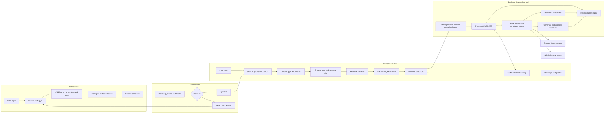
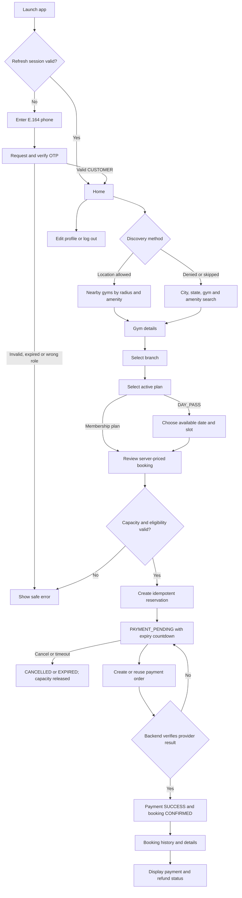
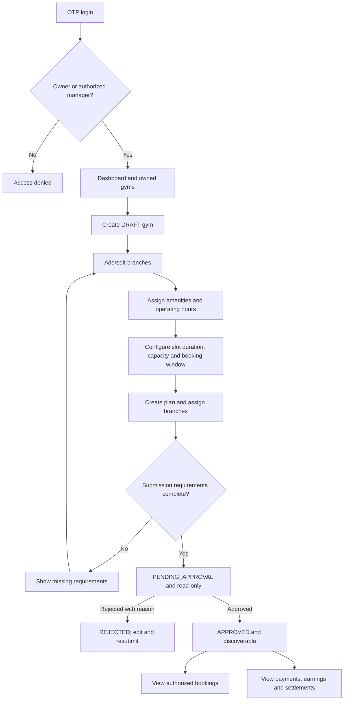
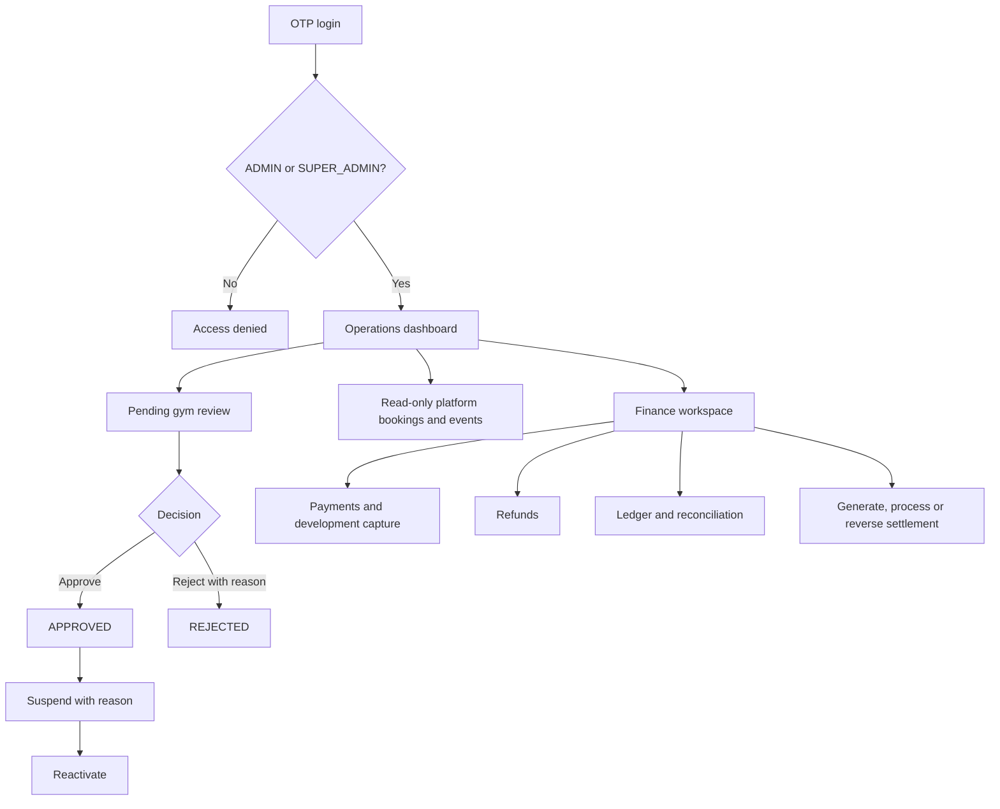
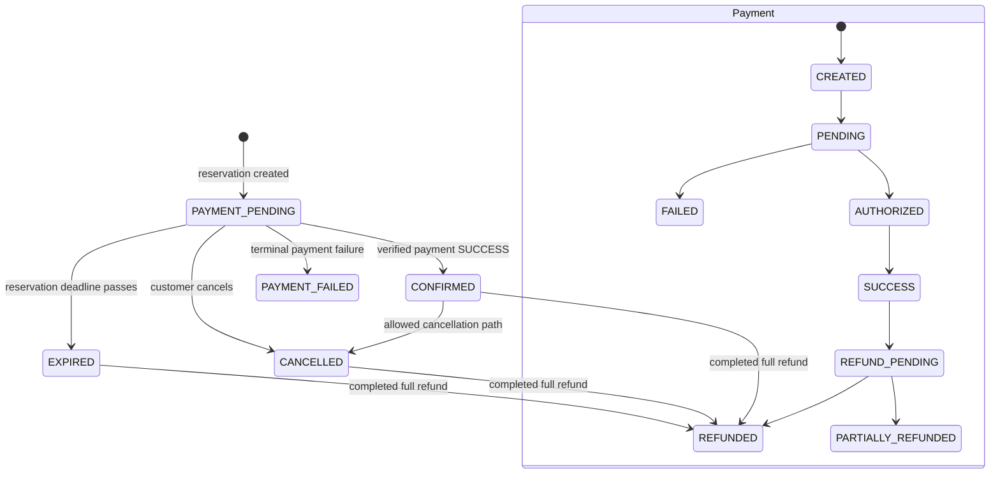

# GYMRide user flows and UAT test cases

This document describes the user journeys implemented in the repository through Phase 6 and provides a repeatable user-acceptance test suite for the web and mobile applications. The repository is the source of truth. Future features such as QR check-in, reviews, notifications, hybrid plans, recommendations, AI, and production deployment are intentionally excluded.

## Product surfaces and actors

| Surface | Primary actor | Purpose |
| --- | --- | --- |
| Customer mobile app | Customer | Discover gyms, select a branch and plan, reserve capacity, pay, and manage bookings/profile |
| Partner web panel | Gym owner or authorized manager | Configure gyms, branches, plans, schedules, capacity, bookings, earnings, and settlements |
| Admin web panel | Admin or super admin | Review gyms, inspect bookings, operate development payments/refunds/settlements, and reconcile finance |
| Backend API | All surfaces and payment/payout providers | Enforce identity, authorization, state transitions, capacity, commercial snapshots, and financial integrity |

There is currently no customer-facing web application. “Web” in this document means the Partner and Admin panels.

## Local UAT environment

| Component | Local address |
| --- | --- |
| Backend and Swagger | `http://localhost:3000/api/v1` and `http://localhost:3000/api/docs` |
| Admin panel | `http://localhost:3001` |
| Partner panel | `http://localhost:3002` |
| Mobile app | Expo/React Native development build or Expo Go, configured for the local API |

Development-only identities:

| Role | Phone | Authentication |
| --- | --- | --- |
| Admin | `+919876543210` | Request OTP; use the dynamically displayed development OTP |
| Gym owner/partner | `+919876543211` | Request OTP; use the dynamically displayed development OTP |
| Customer | `+919876543212` | Request OTP; use the dynamically displayed development OTP |

The OTP is generated per request, expires after five minutes, and is single-use. These are local development accounts, not production credentials. The development payment and payout providers simulate outcomes and never represent external money movement.

## End-to-end marketplace flow

## Customer mobile flow

Important boundary: the customer client never confirms a booking by sending a success boolean. Confirmation is produced only after the backend validates provider evidence and atomically updates the payment, booking, earning, and ledger.

## Partner web flow

Partner financial records are read-only. A partner must select an authorized gym or branch before finance data is fetched.

## Admin web flow

## Critical state flow

A partial refund changes payment/earning/ledger values but must not incorrectly mark the whole booking `REFUNDED`.

## UAT execution rules

- Execute P0 cases before release and P1 cases before phase acceptance. P2 cases may be scheduled unless they cover a changed area.
- Record the build/commit, device/browser, tester, time, result (`PASS`, `FAIL`, `BLOCKED`), and evidence for every run.
- Use unique gym names and idempotency keys when a test creates data. Do not edit or delete financial history to “reset” a test; create compensating test transactions where required.
- Test partner authorization with two independently owned gyms. Never reuse Partner A’s token as the setup for Partner B.
- For real Razorpay testing, use official test credentials and a native development build. Expo Go and the development provider are not evidence of native Razorpay success.

## Shared authentication and session test cases

| ID | Priority | Scenario | Preconditions | Steps | Expected result |
| --- | --- | --- | --- | --- | --- |
| AUTH-01 | P0 | Admin OTP login | Development backend; seeded admin | Open Admin; enter admin phone; request OTP; enter displayed OTP | Dashboard opens; profile contains `ADMIN`/`SUPER_ADMIN`; token values are not rendered |
| AUTH-02 | P0 | Partner OTP login | Development backend; seeded partner | Open Partner; request and verify OTP | Partner dashboard opens and only authorized gym data is visible |
| AUTH-03 | P0 | Customer mobile OTP login | Mobile app points to local API | Enter customer phone; request OTP; enter displayed code | Home opens; user has `CUSTOMER`; refresh credential is stored through the platform storage adapter |
| AUTH-04 | P0 | Invalid/expired OTP | An OTP was requested | Enter an incorrect code; then test an expired code | Safe `INVALID_OTP`/`OTP_EXPIRED` message; no session; attempts/rate limits remain enforced |
| AUTH-05 | P0 | Wrong-role portal access | Valid customer or partner OTP | Try customer in Admin; try customer in Partner; try admin/partner-only identity in mobile | Access is denied and local session is cleared; protected data is never displayed |
| AUTH-06 | P1 | Session restoration | Successfully signed in | Reload web tab; restart mobile process | Same authorized session restores through refresh; profile is loaded before protected navigation |
| AUTH-07 | P0 | Logout during API failure | Authenticated; simulate offline/logout failure | Select Log out | Local tokens/query data are cleared and login screen appears even if server logout fails |
| AUTH-08 | P1 | Concurrent refresh | Authenticated session with expired access token | Trigger multiple API reads at once | One refresh operation is shared; requests recover without token-rotation race |

## Partner web UAT cases

| ID | Priority | Scenario | Preconditions | Steps | Expected result |
| --- | --- | --- | --- | --- | --- |
| PWEB-01 | P1 | Dashboard totals | Partner logged in | Open Dashboard | Total gyms/branches and status counts match owned resources only; loading/error states are usable |
| PWEB-02 | P0 | Create a gym | Partner logged in | Open Create gym; submit empty/invalid form; then enter valid name/description | Validation blocks invalid data; valid gym is created as `DRAFT` and detail page opens |
| PWEB-03 | P0 | Create and edit a branch | Editable gym exists | Add address, city, state, postal code, coordinates and timezone; save; edit | Valid data persists; invalid coordinates/email/phone are rejected; duplicate branch name is rejected |
| PWEB-04 | P1 | Configure amenities | Branch exists | Select amenities; save; reload | Selected amenities persist and only known amenity IDs are accepted |
| PWEB-05 | P0 | Configure operating hours | Branch exists | Add normal hours; try overlapping and close-before-open periods; save valid schedule | Invalid periods are blocked; valid branch-local hours persist |
| PWEB-06 | P0 | Configure slot inventory | Active branch has hours | Set slot duration, capacity, booking window and minimum advance; inspect date | Future slots follow local hours; capacity/available totals are correct; invalid values fail |
| PWEB-07 | P0 | Create and activate plan | Gym has branch | Create day pass with rupee price and branch; activate it | Price is persisted exactly in paise; active plan becomes customer-visible for assigned branch |
| PWEB-08 | P0 | Block incomplete review submission | Draft gym lacks a required branch/hour | Submit for review | Submission fails with stable missing-requirement labels; gym remains editable `DRAFT` |
| PWEB-09 | P0 | Successful submission and review lock | All requirements complete | Confirm Submit for review; attempt edit | Gym becomes `PENDING_APPROVAL`; review-state profile is read-only |
| PWEB-10 | P1 | Rejection correction and resubmission | Admin rejected gym with reason | Open gym; read feedback; edit; resubmit | Reason is visible; rejected gym is editable; new submission becomes `PENDING_APPROVAL` |
| PWEB-11 | P0 | Authorized booking filters | Approved gym has bookings | Filter by gym, branch, status and date; paginate; open detail | Only authorized bookings appear; filters persist in URL; lifecycle and commercial snapshot are correct |
| PWEB-12 | P0 | Partner finance views | Authorized gym has successful payment | Select gym; inspect Overview, Payments, Earnings, Settlements; filter/paginate/open details | Aggregates match records; no provider secrets; earnings cannot be modified |
| PWEB-13 | P0 | Partner finance IDOR | Partner A and Partner B each own a gym | As A, request B’s booking/payment/earning/settlement IDs and B’s gym filter | Every request is denied or not found; no B metadata or totals leak |
| PWEB-14 | P1 | Branch status control | Partner owns branch | Deactivate then reactivate branch | Status updates; suspended branches remain non-editable by partner; discovery respects active status |

## Admin web UAT cases

| ID | Priority | Scenario | Preconditions | Steps | Expected result |
| --- | --- | --- | --- | --- | --- |
| AWEB-01 | P1 | Operations dashboard | Admin logged in | Open Dashboard and pending review list | Counts match platform data; pending link and loading/error states work |
| AWEB-02 | P0 | Approve complete gym | Gym is `PENDING_APPROVAL` | Review owner, branches, hours and plans; approve; confirm | Gym becomes `APPROVED`; action appears once in audit; gym becomes discoverable |
| AWEB-03 | P0 | Reject gym with reason | Gym is `PENDING_APPROVAL` | Choose Reject; submit missing/short reason; then valid reason | Invalid reason blocked; gym becomes `REJECTED`; reason/audit visible to partner |
| AWEB-04 | P0 | Suspend and reactivate | Gym is `APPROVED` | Suspend with reason; verify discovery; reactivate | Suspended gym is removed from discovery; both audited transitions follow state rules |
| AWEB-05 | P1 | Platform booking inspection | Bookings in several states | Filter by status/gym/branch/dates; paginate; open detail | Read-only results and lifecycle events match database; no customer contact details leak |
| AWEB-06 | P0 | Development payment capture | Development payment is `PENDING` | Finance → Payments; open payment; confirm simulation | Payment becomes `SUCCESS`; booking becomes `CONFIRMED`; earning and required ledger entries appear once; no real money moves |
| AWEB-07 | P0 | Partial refund | Successful captured payment exists | Request a valid partial refund in paise; confirm | Refund succeeds/pends per provider; refunded total and earning deduction update; booking is not `REFUNDED` |
| AWEB-08 | P0 | Full/excess/duplicate refund | Partially or fully refundable payment exists | Request remaining full amount; then excess and duplicate requests | Full refund yields payment/booking refund semantics; excess returns `REFUND_AMOUNT_EXCEEDED`; duplicates do not double-post |
| AWEB-09 | P0 | Settlement generation and processing | Eligible unsettled earnings exist | Generate period settlement; retry same request; process READY settlement | Eligible earnings included once; retry is idempotent; development payout is clearly simulated; status reaches `PAID` |
| AWEB-10 | P0 | Settlement reversal | Settlement is `PAID` | Enter reason; confirm reversal; retry | Audited reversal entry is appended once; payable liability restored; original ledger/history unchanged |
| AWEB-11 | P0 | Ledger immutability | Financial activity exists | Inspect ledger; attempt unsupported edit/delete via UI/API | Entries are read-only/append-only; correction requires a compensating entry |
| AWEB-12 | P0 | Reconciliation report | Create or fixture an inconsistent state in isolated test DB | Run/inspect reconciliation | Finding code and entity ID are reported; scan does not silently mutate finance data |
| AWEB-13 | P1 | Finance filters and pagination | More than one page of finance records | Apply gym/branch/date/status filters and navigate pages | Totals/list results honor filters; settlement ignores branch filter by design; empty/error states are clear |

## Customer mobile UAT cases

| ID | Priority | Scenario | Preconditions | Steps | Expected result |
| --- | --- | --- | --- | --- | --- |
| MOB-01 | P0 | First-time OTP login | Fresh install/session | Enter `+919876543212`; request code; verify displayed development code | Home appears and a customer account/session is created safely |
| MOB-02 | P1 | OTP resend and input rules | On verification screen | Enter letters/too few digits; try resend during 45-second cooldown; resend afterward | Only six digits accepted; verify disabled until valid; cooldown prevents rapid resend |
| MOB-03 | P0 | Restore and revoke session | Customer logged in | Restart app; then invalidate refresh token and restart | Valid session restores without login flash; invalid session returns to login and clears customer cache |
| MOB-04 | P1 | Home states | Logged in | Observe loading, populated and no-booking/no-gym states; force API error and retry | Each state is legible; retry succeeds; active bookings link to details |
| MOB-05 | P0 | Nearby discovery with permission | Location services available | Tap Find gyms near me/Use my location; allow permission; change radius/amenities | Coordinates are used once; nearby gyms ordered with distance; invalid radius disables filter |
| MOB-06 | P0 | Location denial fallback | Location permission not granted | Deny/restrict location; search by city/state/name | App explains fallback; city search remains functional; restricted state can open settings |
| MOB-07 | P1 | Discovery filters and pagination | More than 20 matching gyms | Apply search/city/state/amenity filters; scroll; pull to refresh; switch nearby to city | Correct rows load without duplicates; next page and refresh behave correctly |
| MOB-08 | P0 | Gym, branch and plan selection | Approved gym has active branches/plans | Open gym; choose branch; inspect address/amenities/hours; choose active plan | Plans are scoped to selected branch; inactive plans are not selectable; timezone is displayed |
| MOB-09 | P0 | Day-pass slot selection | Active day pass and slot inventory exist | Choose day pass; select date; attempt full/blocked slot; select available slot | Full/blocked slot disabled; available capacity and branch-local time are correct |
| MOB-10 | P1 | Membership plan without slot | Active monthly/quarterly/yearly plan exists | Choose membership plan; continue to review | Review opens without a slot and shows duration/visit limit and authoritative price |
| MOB-11 | P0 | Reserve with server authority | Valid plan/branch/slot | Review; tap Reserve and continue once and repeatedly | One idempotent booking is created; amount/currency come from server snapshot; status is `PAYMENT_PENDING` |
| MOB-12 | P0 | Concurrent last-slot protection | One place remains; two customers ready | Submit both reservations at nearly the same time | At most one capacity hold succeeds; availability never becomes negative |
| MOB-13 | P0 | Development payment journey | `PAYMENT_PROVIDER=development`; pending booking | Continue to payment; note message; Admin simulates capture; refresh booking | App never claims a charge; after authoritative capture, payment is `SUCCESS` and booking `CONFIRMED` |
| MOB-14 | P0 | Razorpay test checkout | Razorpay test credentials and native development build available | Create order; complete test checkout; return to app | Backend validates order, payment, signature, amount, currency and booking before confirmation; secrets never appear in client logs/UI |
| MOB-15 | P0 | Invalid payment proof | Pending booking | Supply invalid signature/wrong order through test harness; refresh | Verification fails with stable safe error; booking remains unconfirmed; no earning/ledger is created |
| MOB-16 | P0 | Reservation cancellation/expiry | Pending booking exists | Cancel one booking; allow another to reach expiry; refresh slots | Status becomes `CANCELLED`/`EXPIRED`; capacity is released exactly once; cancellation does not promise a refund |
| MOB-17 | P1 | Booking list and detail | Customer has mixed booking states | Open Bookings; paginate/refresh; open pending, confirmed and refunded records | Only own bookings appear; grouping/status, amount, slot timezone, payment and refund status are correct |
| MOB-18 | P1 | Profile update | Customer logged in | Update name/email; try invalid or duplicate email; restart | Valid profile persists; validation/API error shown safely; new display name appears after restore |
| MOB-19 | P0 | Customer booking IDOR | Two customers have bookings | As Customer A, request Customer B booking/payment IDs | Access is denied/not found and no B details leak |
| MOB-20 | P1 | Offline and recovery | Customer logged in | Disable network during list load and mutation; reconnect; retry | Offline/error state is visible; mutations are not silently queued or duplicated; manual retry recovers |

## Cross-surface and backend integrity cases

| ID | Priority | Scenario | Preconditions | Steps | Expected result |
| --- | --- | --- | --- | --- | --- |
| INT-01 | P0 | Booking confirmation boundary | Pending booking/payment | Attempt client-side success flag or direct booking status update | Request is ignored/rejected; only verified payment path can confirm booking |
| INT-02 | P0 | Payment order idempotency | Unexpired pending booking | Submit order creation concurrently with same/different client idempotency attempts | One active provider order/payment is reused; no duplicate charge records |
| INT-03 | P0 | Duplicate/out-of-order webhook | Valid signed provider event available | Deliver success twice; deliver delayed failure after success | Event uniqueness prevents duplicate booking/earning/ledger effects; terminal success is not regressed |
| INT-04 | P0 | Invalid webhook signature | Raw provider payload available | Change payload/signature and send | Request rejected; event cannot change payment, booking, earning, or ledger |
| INT-05 | P0 | Atomic payment success | Fault injection in isolated test DB | Fail the success transaction at each internal write boundary | No persistent state has payment `SUCCESS` with missing booking confirmation/earning/ledger |
| INT-06 | P0 | Refund financial consistency | Successful earning exists | Apply partial then full refunds; repeat provider callback | Refunded total never exceeds captured amount; earning/commission/net and ledger reconcile without duplicates |
| INT-07 | P0 | Settlement concurrency | Eligible earnings exist | Run two generation workers for same gym/period | An earning belongs to at most one settlement item; totals remain deterministic |
| INT-08 | P1 | Monetary rounding | Amounts that do not divide evenly by commission BPS | Complete payment/refund and inspect snapshots | All calculations use integer minor units and deterministic rounding; historical snapshots do not change with later config |
| INT-09 | P0 | Sensitive data exposure | Complete representative web/mobile journeys | Inspect UI, network responses and logs | No JWT, refresh token, OTP hash, provider secret, provider payment secret, or internal stack is exposed |
| INT-10 | P1 | Accessibility and responsive use | Current Chrome/Safari and Android/iOS device sizes | Use keyboard/screen reader on web; large text/touch navigation on mobile | Labels, focus order, errors, confirmations, touch targets and core actions remain usable without clipped content |

## UAT execution record template

| Field | Value |
| --- | --- |
| Build/commit | |
| Environment | Local / test / staging |
| Tester | |
| Browser/device/OS | |
| Test case ID | |
| Result | PASS / FAIL / BLOCKED |
| Evidence | Screenshot, video, request ID, or log reference |
| Defect ID and notes | |

## Acceptance exit criteria

- Every P0 case passes on the relevant surface, or has an explicitly accepted release waiver.
- No open authorization, payment-verification, financial-integrity, capacity, or sensitive-data defect remains.
- Partner A cannot access Partner B’s resources, and Customer A cannot access Customer B’s booking/payment details.
- Admin and Partner web pass on supported desktop browsers; the customer app passes on at least one supported Android device/emulator and one supported iOS native build before store readiness is claimed.
- A real/test-provider payment is not claimed unless Razorpay test credentials, signed callbacks, and a native mobile build were actually validated.
- Automated lint, typecheck, unit/integration tests, and builds pass, with any environment-dependent runtime validation recorded separately.
